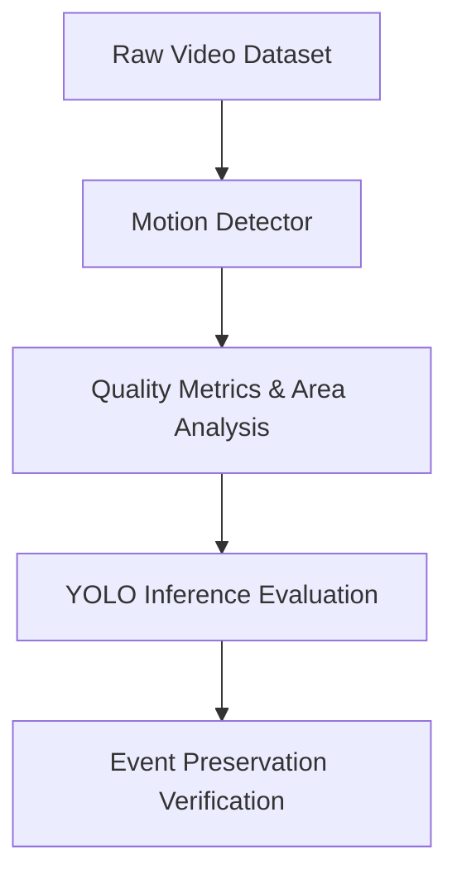

# 📊 Motion Detection Benchmarking & Experimentation Framework

This framework provides a reusable, scalable evaluation harness for benchmarking motion detection algorithms across large datasets of CCTV footage. It calculates forensic metrics, generates comparison visualizations, runs grid search sweeps for parameter optimization, benchmarks deep learning inference impact, and provides event preservation verification.

---

## 🔬 Current Research Hypothesis

> **Hypothesis:**
> *"Motion filtering can significantly reduce deep learning computation while fully preserving critical forensic information in CCTV feeds."*

CCTV surveillance feeds are predominantly static (contain no activity of interest). Running heavy deep learning modules (YOLO detectors, trackers) on every single frame results in massive computational waste. By utilizing lightweight pixel-based background subtractors as an upstream gating filter, we can bypass static frames and invoke the downstream neural networks only on segments containing motion, without sacrificing detection recall for forensic events.

---

## 🛠️ Current Evaluation Pipeline



1. **Video**: Input CCTV feed (discovered recursively in `datasets/videos/`).
2. **Motion Detector**: Baseline (No filtering) or pixel subtractor (Frame Difference, MOG2, KNN, GMM).
3. **Quality Metrics**: Computes frame reduction rate, speed (FPS), continuity score, segment sizes, and motion area ratios.
4. **YOLO Evaluation**: Benchmarks impact on downstream target detector inference load, object recall (person/vehicle counts), execution speeds, and confidences.
5. **Event Preservation**: Calculates if critical event frame ranges (ground truth crime intervals) are retained by the motion filter.

---

## 📂 Directory Organization

When running the framework, files are structured as follows:

```text
├── datasets/
│   └── videos/                     <-- Place your input CCTV video files (.mp4, .avi, etc.) here
├── docs/
│   └── motion_experiment.md        <-- This documentation file
├── apps/
│   ├── run_motion_experiment.py    <-- Core evaluator & parameter sweeps orchestrator
│   └── run_yolo_motion_experiment.py  <-- Downstream YOLO inference impact benchmark runner
├── src/
│   ├── evaluation/
│   │   └── event_metrics.py        <-- Event preservation and recall metric calculations
│   └── motion/
│       └── evaluator.py            <-- Core MotionBenchmarkEvaluator implementation
└── outputs/
    └── experiments/
        ├── motion_results.csv      <-- Standard results for all methods, videos, and area metrics
        ├── motion_area_threshold_search.csv  <-- Results of Area Threshold ignore sweeps
        ├── frame_difference_parameter_search.csv  <-- Results of Frame Difference grid search
        ├── yolo_motion_comparison.csv  <-- YOLO inference comparison data (Exp A vs Exp B)
        └── plots/
            ├── reduction_comparison.png    <-- Chart: Method vs Avg Reduction %
            ├── fps_comparison.png          <-- Chart: Method vs Avg Processing Speed
            ├── continuity_comparison.png   <-- Chart: Method vs Motion Continuity Score
            ├── motion_area_threshold.png   <-- Chart: Threshold % vs Reduction & Continuity
```

---

## 🚀 How to Run the Experiments

Ensure you have your virtual environment active and dependencies installed.

### 1. Run Standard Motion Evaluation & Threshold Sweeps
To run standard benchmarks, quality metric calculations, and the motion area threshold sweep:
```bash
python apps/run_motion_experiment.py --dataset datasets/videos --output-dir outputs/experiments
```

### 2. Run Parameter Grid Search Sweep
To additionally run the grid search sweep evaluating combinations of blur sizes (`5x5`, `11x11`, `21x21`, `31x31`) and thresholds (`10`, `20`, `30`, `50`) for the Frame Difference detector:
```bash
python apps/run_motion_experiment.py --dataset datasets/videos --param-search
```

### 3. Run YOLO Performance Impact Benchmark
To measure YOLO inference execution, object counts, confidence rates, and computational speed comparisons (YOLO-only vs. Motion Filter + YOLO):
```bash
python apps/run_yolo_motion_experiment.py --dataset datasets/videos --output-dir outputs/experiments
```

---

## 📈 Metric Definitions

| Metric Name | CSV Column Header | Definition & Forensic Purpose |
| :--- | :--- | :--- |
| **Video Name** | `video_name` | Name of the video file evaluated. |
| **Method** | `method` | Name of the detector method (`Baseline`, `FrameDifference`, `MOG2`, `KNN`, `GMM`). |
| **Total Frames** | `total_frames` | Total number of frames in the video. |
| **Motion Frames** | `motion_frames` | Total frames where motion was detected. |
| **Discarded Frames** | `discarded_frames` | Total frames filtered out as static. |
| **Reduction %** | `reduction_percentage` | Percentage of discarded frames: $\frac{\text{total} - \text{motion}}{\text{total}} \times 100$. |
| **Processing Time** | `processing_time_seconds` | Execution time of the detector run in seconds. |
| **FPS** | `fps` | Frames processed per second (measures execution throughput). |
| **Motion Continuity Score** | `continuity_score` | Computes consecutive motion transitions divided by total motion frames. A score of `0.0` represents completely isolated frames; a score of `1.0` is perfect continuity. |
| **Avg Segment Length** | `avg_segment_length` | The average number of consecutive frames in each contiguous block of motion. |
| **Num Segments** | `num_segments` | The total number of contiguous motion blocks in the video feed. |
| **Avg Motion Area Ratio** | `average_motion_area_ratio` | Mean ratio of motion pixels divided by total frame pixels: $\frac{\sum \text{motion\_pixels}}{\text{total\_pixels}}$ across all motion-detected frames. |
| **Max Motion Area Ratio** | `maximum_motion_area_ratio` | Maximum motion pixel ratio observed in any single active frame. |
| **Min Motion Area Ratio** | `minimum_motion_area_ratio` | Minimum motion pixel ratio observed in any single active frame. |

### 🔍 Why Motion Area Ratio Matters for CCTV
CCTV camera sensors are highly susceptible to noise (pixel compression artifacts, light flickering, rain, swaying branches).
* **Camera Sensor Noise**: Usually produces extremely small, isolated motion area ratios (often $<0.1\%$).
* **Forensic Activity (Humans/Vehicles)**: Produces larger contiguous blobs with higher motion area ratios (typically $>0.5\%$).
* **Area Threshold Gating**: Sweeping area thresholds (e.g., ignoring frames with $<0.5\%$ motion area ratio) helps isolate actual targets from environmental sensor noise.

---

## 🧪 Future Experiments After Dataset Collection

Once the comprehensive CCTV video dataset is collected, the following research experiments will be executed immediately:

1. **Background Subtractor Benchmarking on Diverse Environments**:
   * Run the batch suite on footage covering varying illumination conditions (night, rain, overcast) and locations (highway, narrow street, indoor corridor) to evaluate subtractor robustness.
2. **Motion Area Gating Optimization**:
   * Analyze the threshold sweeps (`motion_area_threshold_search.csv`) to determine the exact optimal area threshold percentage that filters out the maximum environmental noise while preserving $100\%$ of human/vehicle movement.
3. **YOLO Downstream Inference Reduction Curve**:
   * Quantify how much computation is saved for YOLO across different frame sizes and frame rates, and identify the point of maximum GPU efficiency.
4. **Forensic Event Recall Validation**:
   * Input event timelines (e.g. chain-snatching ranges) and calculate event recall rates using `src/evaluation/event_metrics.py` to mathematically prove that upstream motion filtering preserves all critical criminal activity intervals.
